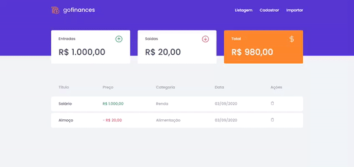

# GoFinances

Este projeto foi realizado com objetivo de estudo durante a jornada do GoStack.
 
É uma aplicação para armazenar transações financeiras de entrada e saída, que deve permitir o cadastro e a listagem dessas transações, fazendo tamém a validação do valor de saída da transação, para que este não exceda o valor que o usuário tem em caixa.
 
O usuário também pode importar esses dados por meio de arquivos `.CSV`

### Preview

<h1 align="center">
  
</h1>

### Recursos 
- [x] ReactJS, Typescript e styled-components
- [x] Integração com a API desenvolvida em NodeJS ( https://github.com/AmandaCarvalho1989/desafio-fundamentos-node2 )

### Como acessar?
- Abra a pasta do projeto no VSCode
- Abra o terminal e digite `npm install` para instalaar as dependências do projeto
- Após a instalação, ainda no terminal digite `npm start` para iniciar o projeto
- Acesse o endereço gerado no Browser 🚀
